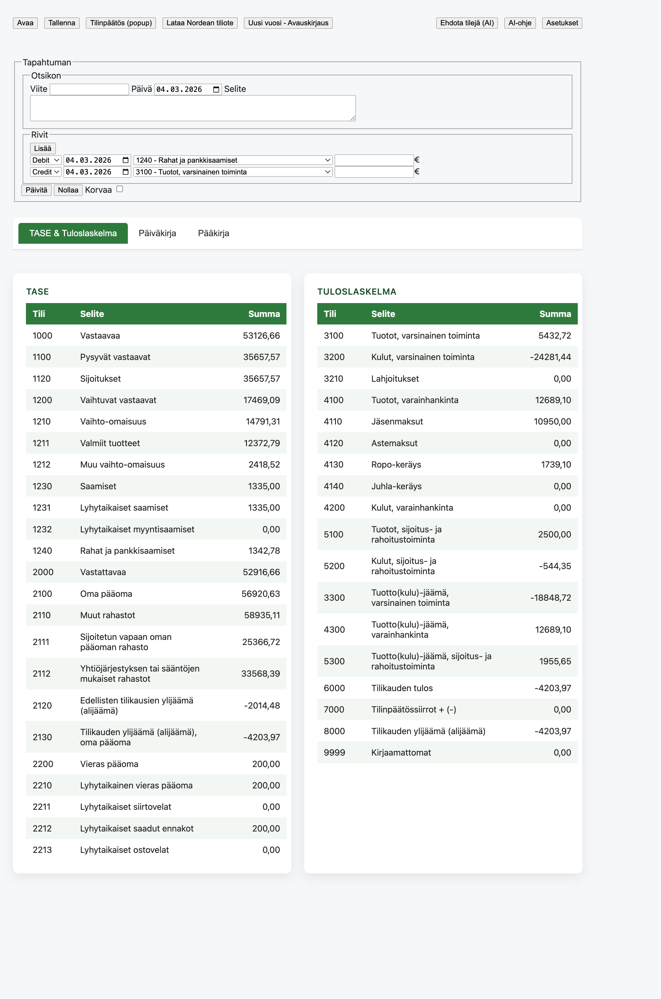
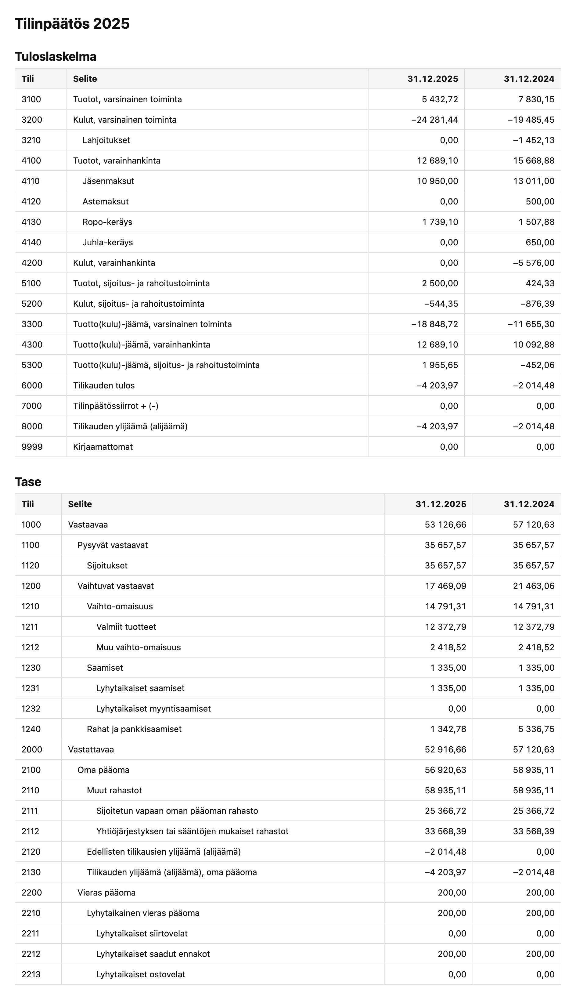

# Treasurer (Rahuri)

Web-based double-entry bookkeeping for Finnish non-profit organizations.  
Rahuri supports journal handling, ledger views, Nordea statement import, AI-assisted mapping, and financial statement output.




## What It Does

- Double-entry bookkeeping with debit/credit balancing
- Journal (`Päiväkirja`) and general ledger (`Pääkirja`) views
- Balance sheet (`Tase`) and income statement (`Tuloslaskelma`)
- Nordea `.nda` import
- AI account suggestions for unmapped entries (`9999`)
- Financial statement popup with year-over-year comparison

## Quick Start

```bash
./start.sh
```

This opens Chrome with required local-file flags and loads `ux.html`.

Manual alternative:

```bash
open -a Google\ Chrome --args --allow-file-access-from-files
```

Then open `ux.html`.

## Browser Support and Startup

Rahuri currently supports **Google Chrome** (or Chromium-compatible Chrome with equivalent flags) for local `file://` usage.

The app needs Chrome to be started with:

`--allow-file-access-from-files`

### macOS

Use:

```bash
./start.sh
```

or:

```bash
open -a "Google Chrome" --args --allow-file-access-from-files "/absolute/path/to/ux.html"
```

### Windows (PowerShell)

```powershell
& "C:\Program Files\Google\Chrome\Application\chrome.exe" --allow-file-access-from-files "C:\path\to\treasurer\ux.html"
```

If Chrome is installed under user profile:

```powershell
& "$env:LOCALAPPDATA\Google\Chrome\Application\chrome.exe" --allow-file-access-from-files "C:\path\to\treasurer\ux.html"
```

### Linux

```bash
google-chrome --allow-file-access-from-files "/path/to/treasurer/ux.html"
```

## Documentation

- Detailed usage guide: [`docs/USAGE.md`](docs/USAGE.md)
- Main source files:
  - UI: `ux.html`, `ux.css`, `ux.js`
  - Core accounting: `treasurer.js`, `general_ledger.js`
  - Bank import: `nordea.js`
  - AI mapping: `gemini.js`

## License

Dual license:

- **GPL-3.0** for non-profit organizations
- **Commercial license** for for-profit/commercial use

See [`LICENSE`](LICENSE) for details.

## Accounting References

Rahuri account structure is based on official Finnish standards:

- [Finnish Accounting Act (2015/1753)](https://www.finlex.fi/fi/laki/alkup/2015/20151753)
- [MC-2024-1 Code Scheme](https://koodistot.suomi.fi/codescheme;registryCode=sbr-fi-code-lists;schemeCode=MC-2024-1)
- [MC67 Extension (TASE)](https://koodistot.suomi.fi/extension;registryCode=sbr-fi-code-lists;schemeCode=MC-2024-1;extensionCode=MC67)
- [MC66 Extension (Tuloslaskelma)](https://koodistot.suomi.fi/extension;registryCode=sbr-fi-code-lists;schemeCode=MC-2024-1;extensionCode=MC66)
